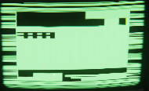
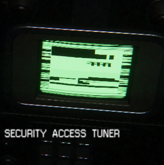
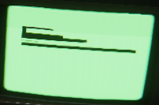

## Alien Isolation Hacking Tool Graphics: With Two.js

## Introduction:

The aim of this project is to learn two.js and experiment with generating
patterns. I really liked the pseudo-random patterns displayed in the game
Alien: Isolation, as seen in the pictures below:

So I attempt to simulate them.
A very basic version of the code runs [here][display]. This code runs slowly at
the moment. The following improvements will be done in the next version,
Proper hoisting/scope and code refactoring will be done. In addition,
more efficient geneation of shapes will be looked at.

[display]: http://www.cumulativeparadigms.org/html/ai_sim/
